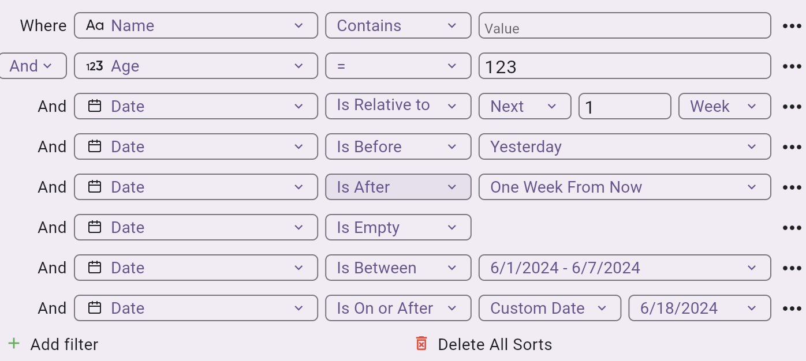

# Document Flutter Dynamic Filter

# [Preview Link](https://phatdat-dev.github.io/flutter_dynamic_filter/) 🔗

<div align="center">
  
  
</div>

### Setup for filter

Create varriable

```dart
final ValueNotifier<Set<FieldSortOrder>> sortOrders = ValueNotifier({});
final ValueNotifier<List<FieldAdvancedFilter>> advancedFilter = ValueNotifier([]);
```

Init example Data

```dart
late final List<Map<String, dynamic>> originExampleData;
late final ValueNotifier<List<Map<String, dynamic>>> exampleDataSearch;

@override
void initState() {
  originExampleData = ExampleData.generateExampleData();
  exampleDataSearch = ValueNotifier(originExampleData);
  super.initState();
}
```

Widget

```dart
// Sort Button
SizedBox(
  width: 130,
  child: SortMenu(
    sortOrders: sortOrders,
    fields: ExampleData.fields,
    onChanged: (sortOrders) {
      final filterEngine = FilterEngine(
        data: originExampleData,
        sortOrders: sortOrders,
      );
      final result = filterEngine.sortList();
      exampleDataSearch.value = result;
    },
  ),
),
// Filter Button
SizedBox(
  width: 130,
  child: AdvancedFilterButton(
    advancedFilter: advancedFilter,
    fields: ExampleData.fields,
    onChanged: (advancedFilter) {
      final filterEngine = FilterEngine(
        data: originExampleData,
        filterGroup: FilterGroup(name: "My Filter", rules: advancedFilter),
      );
      final result = filterEngine.filterList();
      exampleDataSearch.value = result;
    },
  ),
),
// Sort & Filter
SizedBox(
  width: 130,
  child: ElevatedButton(
    child: const Text("Apply Filter and Sort"),
    onPressed: () {
      final filterEngine = FilterEngine(
        data: originExampleData,
        filterGroup: FilterGroup(name: "Name of your filter", rules: advancedFilter.value),
        sortOrders: sortOrders.value,
      );
      final result = filterEngine.applyFilterAndSort();
      exampleDataSearch.value = result;
    },
  ),
)
```
